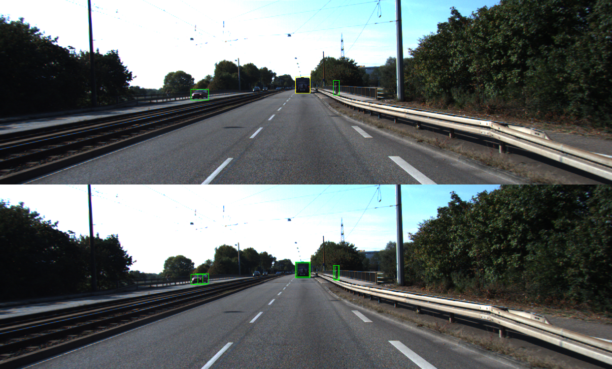
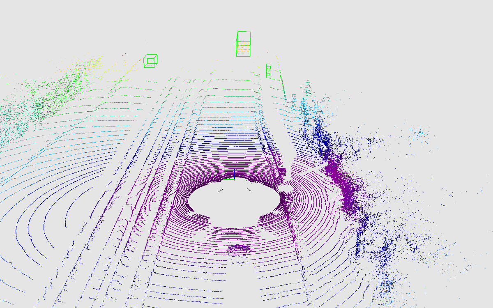

# kitti_object_vis
A visualization project for kitti-object dataset

# Acknowledgement

This repo benefits from kuixu's [kitti_object_vis](https://github.com/kuixu/kitti_object_vis).

# Installation

For compatibility, I strongly recommend you use python=3.7 with vtk=8.1.2, mayavi=4.7.2 and pyqt5=5.15.6, which has been tested successfully on my Ubuntu=18.04 machine. **Other combinations might bring errors or warnings!**

1. first clone this repo to your local machine:

```bash
git clone https://github.com/Muyiyunzi/kitti_object_vis.git
cd kitti_object_vis
```

2. create a conda environment (e.g. named kitti-vis) by:

```bash
conda create -n kitti-vis python=3.7
conda activate kitti-vis
```

3. install the requirements by:

```bash
pip install -r requirements
```

4. organize the dataset by:


# Usage

1. [visualization.py](visualization.py)

visualize 2D, 3D gt bboxes (& pred bboxes) in 2D image and 3D mayavi scene, in the meantime saving them if you'd like to.

```bash
python visualization.py
```




2. [checkproj.py](checkproj.py)

project the 3d bbox into 2d image, then check if the projected bbox's min and max boundary matches with the 2d bbox.

the results will be shown in the 'save/logs' folder, please check the codes for further reference.

```bash
python checkproj.py
```


# License

[MIT License](LICENSE)